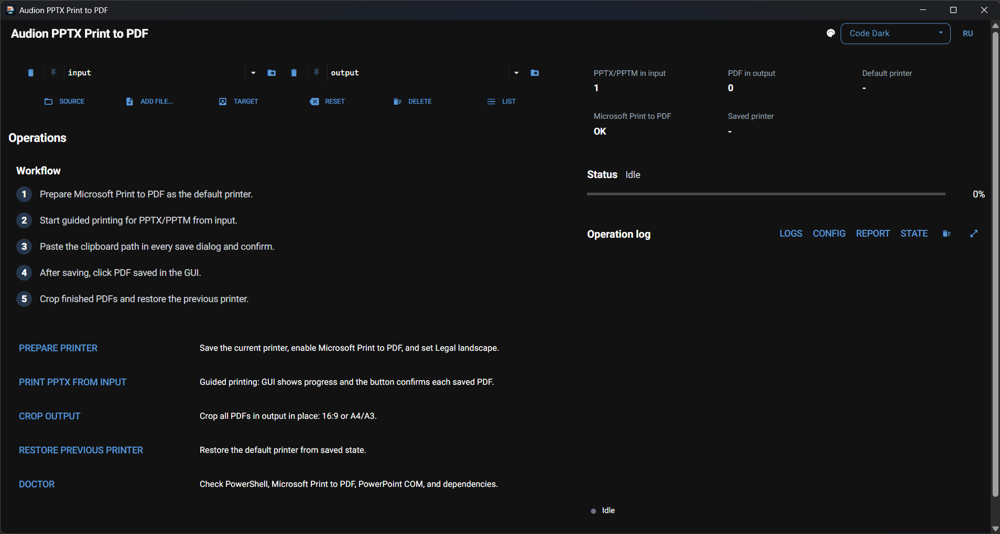

# Audion PPTX Print to PDF Tool

<!-- audion:release -->
   

**Version 1.3.1** · 2026-08-25 · 78.5 MB

- [Direct download](https://audion.dev/get/pptx-print-to-pdf-tool/1.3.1/Audion_PPTX_Print_to_PDF_Tool_v1.3.1_Full.zip) — unmetered, no rate limits
- [Project page](https://audion.dev/downloads/pptx-print-to-pdf-tool) — every version and how to install

`SHA-256: a68186db33912b0317361b345960d217706aa1a6aa35db61a1e587cb31594e57`

---

An **Audion** tool, published by [Tensionix](https://github.com/Tensionix).
<!-- /audion:release -->

Portable Windows workflow with a NiceGUI shell for batch-printing PowerPoint files through **Microsoft Print to PDF** and then cropping the saved PDFs in `output` to **16:9** or **A4/A3** proportions.

## Main workflow

1. Run `launcher_gui.cmd` for the guided shell, or open it from `launcher_project.cmd` / `launcher_project_ru.cmd`.
2. Prepare **Microsoft Print to PDF** as the default printer.
3. Put `.pptx` or `.pptm` files into `input`.
4. Start guided printing. For every Microsoft Print to PDF dialog, paste the full path from the clipboard and save the PDF.
5. Return to the GUI and click `PDF SAVED` after each file.
6. Optionally crop all PDFs in `output` to `16:9` or `A4/A3`, then restore the previous default printer.

## Canonical Workbench labels

The GUI uses the canonical shared Workbench. Its address row is named **Source / Target**, and its action bar uses the same labels in every project: **Source**, **Add file...**, **Target**, **Reset**, **Delete**, **List**.

- **Source** accepts either a presentation folder or one `.pptx` / `.pptm` file.
- **Target** selects the folder for saved and cropped PDFs.
- The GUI and CLI/backend use the same selected routes.
- **Reset** returns to project `input` / `output` and clears unpinned path history.
- **Delete** is irreversible and asks for confirmation before clearing both routes.

## Main launchers

- `launcher_gui.cmd` - guided GUI shell with themes, RU/EN switch, status cards, operation log, and child operation screens
- `launcher_project.cmd` - English unified launcher with `FZF + CMD fallback`
- `launcher_project_ru.cmd` - Russian mirror of the English launcher with translated UI only

If `fzf.exe` is missing, the project launcher automatically falls back to the built-in `choice` menu.

## Compatibility wrappers

The simple one-click wrappers are still available and call `run_action.cmd`:

- `01_Enable_And_Set_Microsoft_Print_to_PDF_Default.cmd`
- `03_Print_All_PPTX_From_Input.cmd`
- `05_Crop_All_PDFs_From_Output_16x9_Exact.cmd`
- `06_Crop_All_PDFs_From_Output_A4_A3.cmd`
- `04_Restore_Previous_Default_Printer.cmd`
- `09_Doctor.cmd`

## Service layer

- `builder_main.cmd` - template-owned builder entry point
- `launcher_tools.cmd` - template-owned tools and release launcher
- `install\` - build, install, verify, and release helpers
- `system_core\license\` and `licenses\` - release licensing support layer

## Key folders

- `input` - source PPTX/PPTM files
- `output` - saved PDFs that will be cropped
- `logs` - session logs
- `state` - saved printer state
- `config` - project settings
- `report` - generated reports and GUI artifacts
- `system_core` - PowerShell and Python helpers
- `GitHub` - GitHub-facing project docs
- `._runtime` - launcher temp files for the `FZF` menu path

## Notes

- The print step is guided, not silent. This keeps Microsoft Print to PDF and PowerPoint font rendering in control.
- `--skip-existing` skips PDFs that are already present in `output`.
- The GUI intentionally does not show toasts for simply opening standard folders.
- The `FZF` temp scheme is split by language:
  - `project_menu_en*`
  - `project_menu_ru*`
- In `CMD fallback` mode, `._runtime` may stay empty, which is expected.
